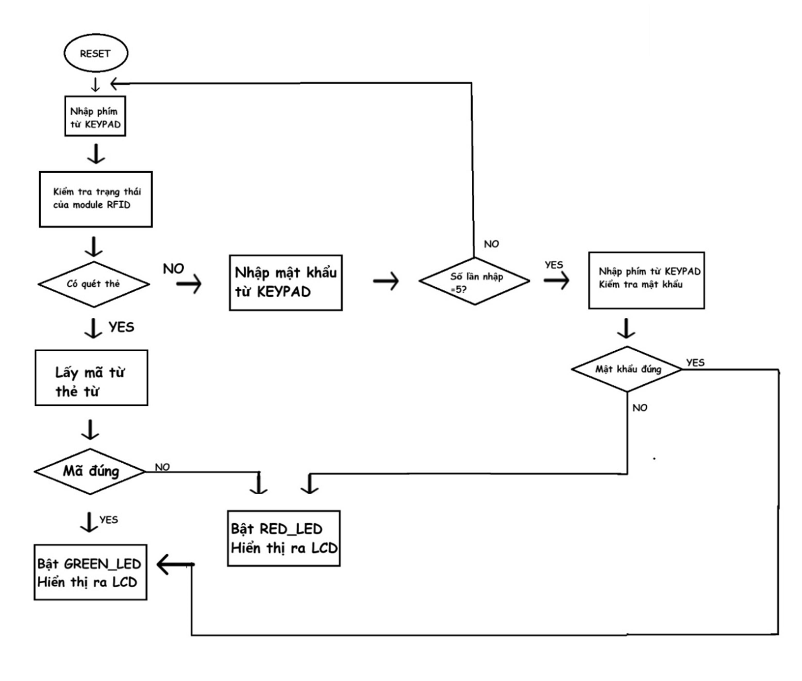
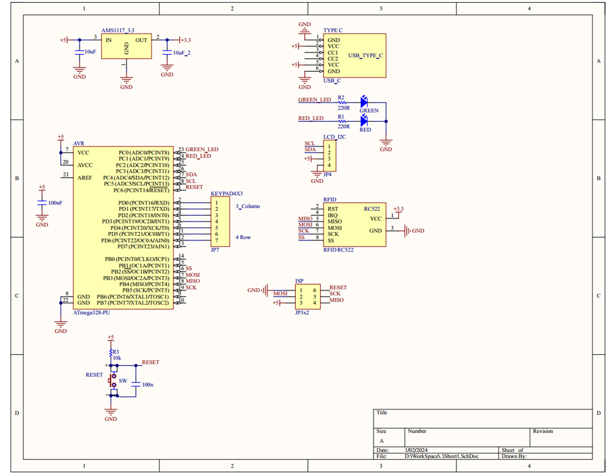
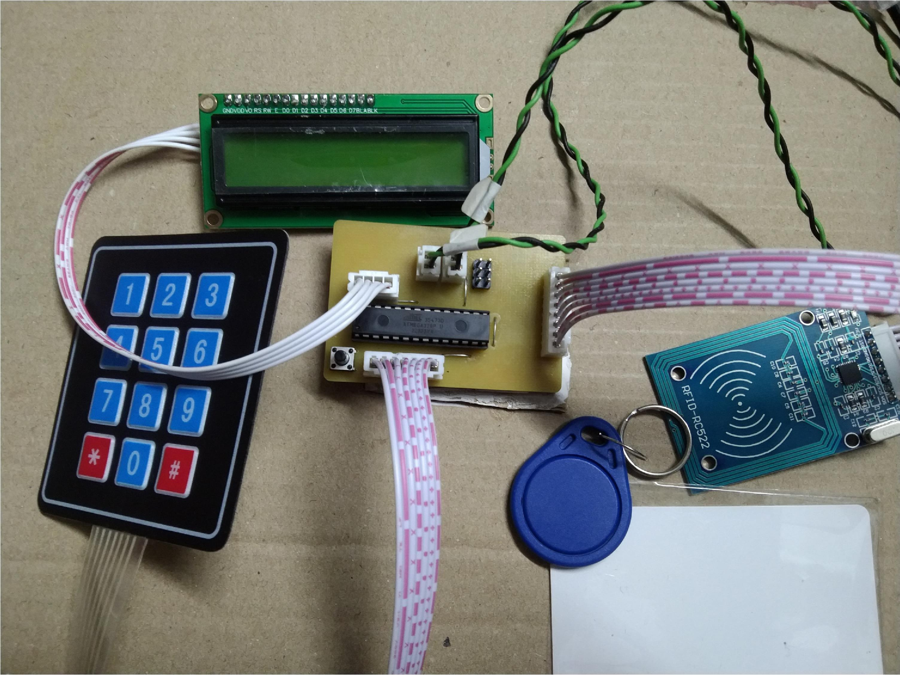
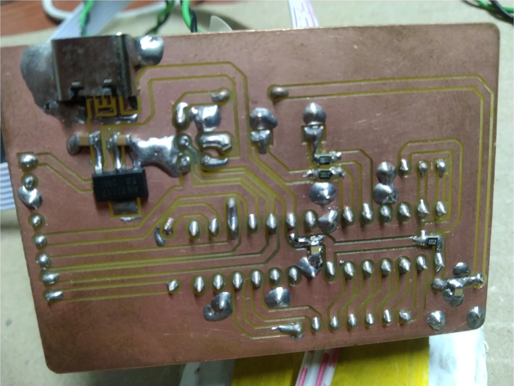

The smart door lock system was developed using two versions: one based on the STM32F103 microcontroller programmed with the CMSIS abstraction layer on the Keil uVision5 platform, with code uploaded via the ST-Link programmer; and the other version based on the ATmega328P microcontroller, programmed in C using Microchip Studio and uploaded using a USBasp programmer through the ProgISP software.

####### SYSTEM FLOW ########

-------------------------------------------------------------------------------------------------------------------------------------------------------------------------------------------------------------------------------------------------------------------------------------------------

The main hardware components of the project include an LCD1602 I2C module, a 4x4 matrix keypad, indicator LEDs, and an RC522 RFID module. The system demonstrates a smart door lock that utilizes both RFID authentication and password entry to unlock. When the user enters the correct password or scans an authorized RFID card, the OLED screen displays a confirmation message and the green LED lights up. Conversely, if the password is incorrect or the card is unauthorized, the OLED displays an error message and the red LED turns on.

########### SCHEMATIC ############

########### LAYOUT #############
.

########### PRODUCT.1 #############
.

########### PRODUCT.2 #############
.
